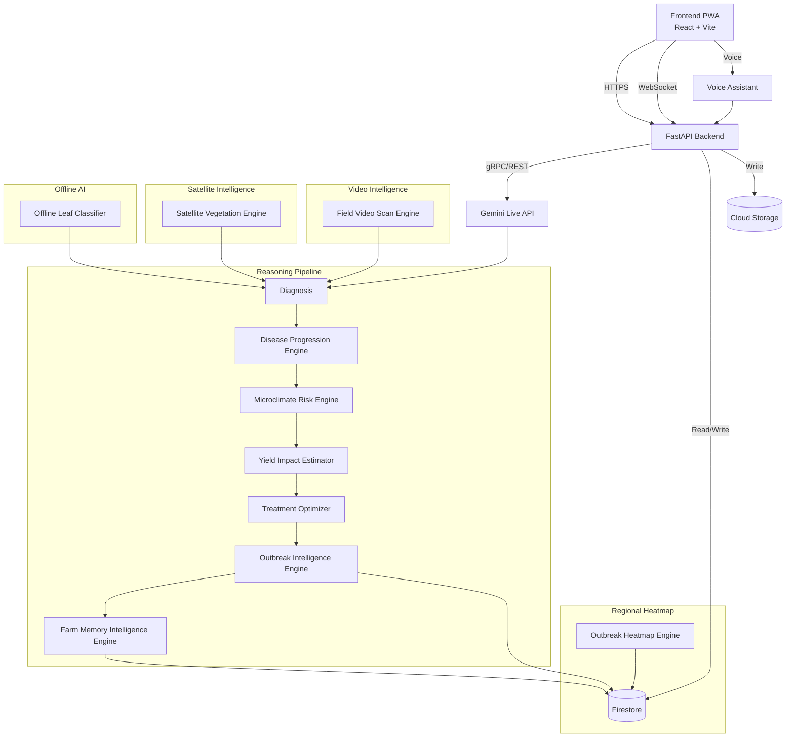

# Architecture

```mermaid
graph TD
    Client[Frontend PWA\nReact + Vite] -->|HTTPS| API[FastAPI Backend]
    Client -->|WebSocket| API
    API -->|gRPC/REST| Gemini[Gemini Live API]
    API -->|Read/Write| Firestore[(Firestore)]
    API -->|Write| GCS[(Cloud Storage)]

    subgraph Reasoning Pipeline
      D[Diagnosis] --> P[Disease Progression Engine]
      P --> M[Microclimate Risk Engine]
      M --> Y[Yield Impact Estimator]
      Y --> T[Treatment Optimizer]
      T --> O[Outbreak Intelligence Engine]
      O --> F[Farm Memory Intelligence Engine]
    end

    Gemini --> D
    O --> Firestore
    F --> Firestore

    subgraph Video Intelligence
      V[Field Video Scan Engine] --> D
    end

    subgraph Satellite Intelligence
      S[Satellite Vegetation Engine] --> D
    end

    subgraph Offline AI
      OA[Offline Leaf Classifier] --> D
    end

    subgraph Regional Heatmap
      H[Outbreak Heatmap Engine] --> Firestore
    end

    Client -->|Voice| VA[Voice Assistant]
    VA --> API
```

